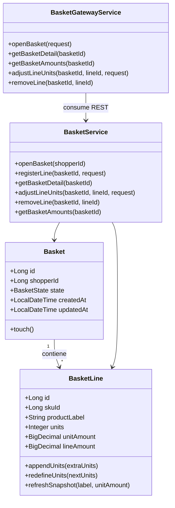

# Diagrama de Clases

```mermaid
classDiagram
    class Basket {
      +Long id
      +Long shopperId
      +BasketState state
      +LocalDateTime createdAt
      +LocalDateTime updatedAt
      +touch()
    }

    class BasketLine {
      +Long id
      +Long skuId
      +String productLabel
      +Integer units
      +BigDecimal unitAmount
      +BigDecimal lineAmount
      +appendUnits(extraUnits)
      +redefineUnits(nextUnits)
      +refreshSnapshot(label, unitAmount)
    }

    class BasketService {
      +openBasket(shopperId)
      +registerLine(basketId, request)
      +getBasketDetail(basketId)
      +adjustLineUnits(basketId, lineId, request)
      +removeLine(basketId, lineId)
      +getBasketAmounts(basketId)
    }

    class BasketGatewayService {
      +openBasket(request)
      +getBasketDetail(basketId)
      +getBasketAmounts(basketId)
      +adjustLineUnits(basketId, lineId, request)
      +removeLine(basketId, lineId)
    }

    Basket "1" --> "*" BasketLine : contiene
    BasketService --> Basket
    BasketService --> BasketLine
    BasketGatewayService --> BasketService : consume REST
```
