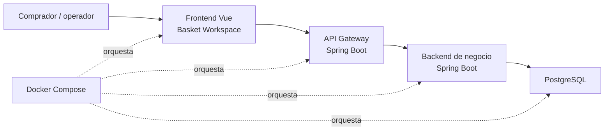

# Diagrama de Contexto

```mermaid
flowchart LR
    U["Comprador / operador"] --> F["Frontend Vue<br/>Basket Workspace"]
    F --> G["API Gateway<br/>Spring Boot"]
    G --> B["Backend de negocio<br/>Spring Boot"]
    B --> D["PostgreSQL"]
    DC["Docker Compose"] -. orquesta .-> F
    DC -. orquesta .-> G
    DC -. orquesta .-> B
    DC -. orquesta .-> D
```
