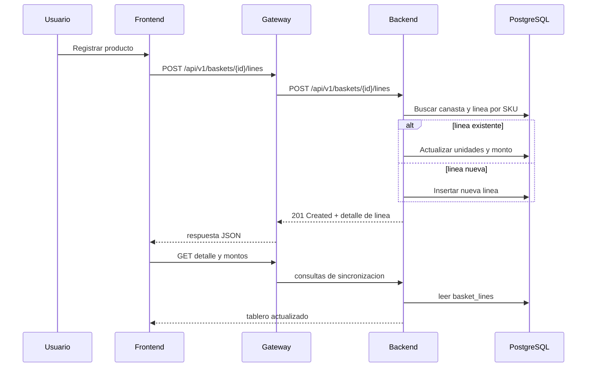

# Diagrama de Secuencia

```mermaid
sequenceDiagram
    participant U as Usuario
    participant F as Frontend
    participant G as Gateway
    participant B as Backend
    participant DB as PostgreSQL

    U->>F: Registrar producto
    F->>G: POST /api/v1/baskets/{id}/lines
    G->>B: POST /api/v1/baskets/{id}/lines
    B->>DB: Buscar canasta y linea por SKU
    alt linea existente
        B->>DB: Actualizar unidades y monto
    else linea nueva
        B->>DB: Insertar nueva linea
    end
    B-->>G: 201 Created + detalle de linea
    G-->>F: respuesta JSON
    F->>G: GET detalle y montos
    G->>B: consultas de sincronizacion
    B->>DB: leer basket_lines
    B-->>F: tablero actualizado
```
