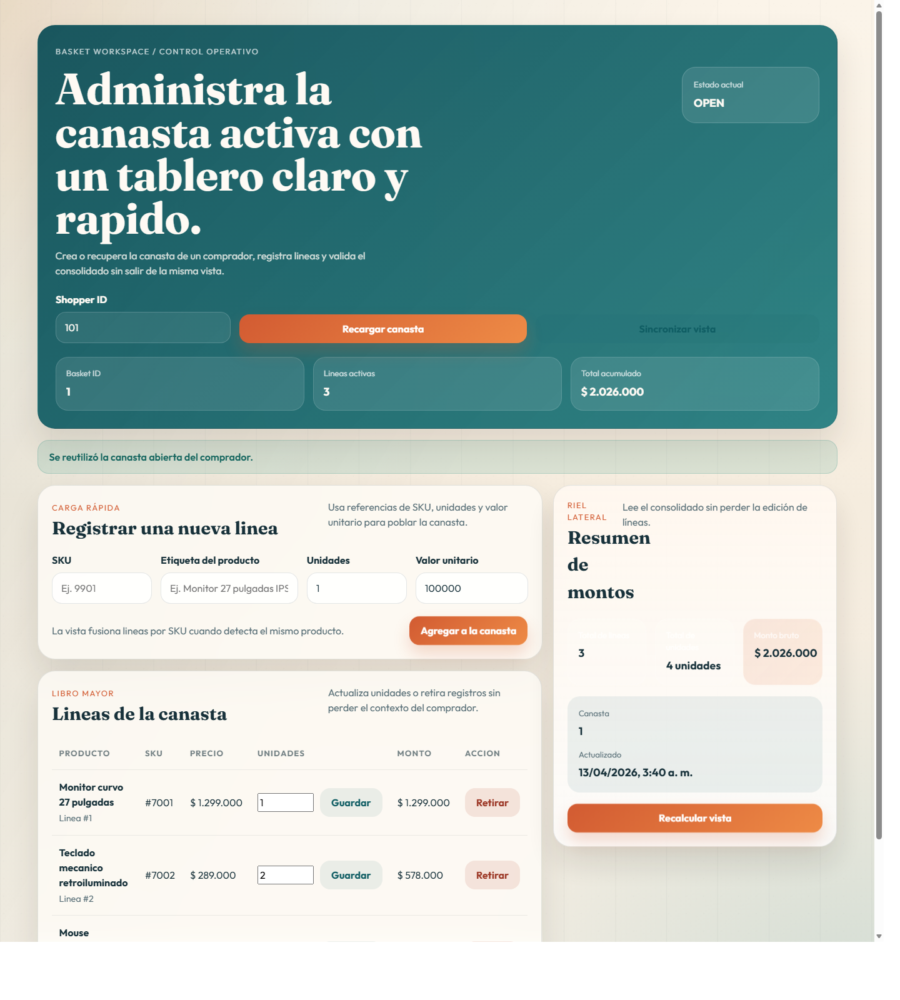
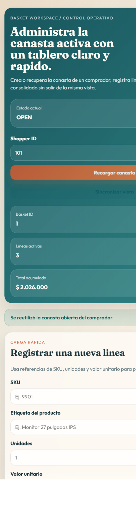

# Introduccion

`Basket Workspace` es un proyecto de carrito de compras enfocado en gestionar una canasta activa por comprador desde una experiencia visual operativa. El sistema trabaja con las entidades `Basket` y `BasketLine`, expone contratos REST claros y organiza la informacion para que el flujo de compra pueda consultarse y administrarse con facilidad.

## Objetivo

El sistema permite abrir una canasta activa por comprador, registrar productos, consultar el detalle operativo, ajustar unidades, retirar lineas y obtener un consolidado monetario desde una sola interfaz.

## Alcance funcional

- apertura o reutilizacion de una canasta activa
- registro incremental de lineas por SKU
- consulta del detalle con lineas ordenadas
- ajuste puntual de unidades
- retiro individual de lineas
- calculo de totales globales
- tablero web responsivo apoyado por `API Gateway`

## Evidencia visual

Vista principal de escritorio:

Vista angosta para validacion responsive:

